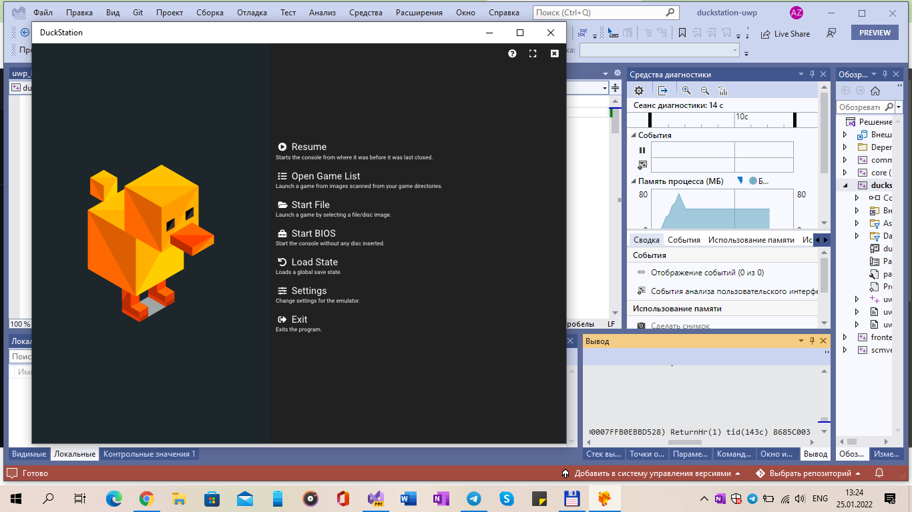

# DuckStation

An attempt to convert the original (DuckStation) over to UWP (Win 10, SDK 19041)

## Screenshots

## My IDE
Visual Studio 2022 Preview (Newest)

## Features (cloned from original, heh!)

- CPU Recompiler/JIT (x86-64, armv7/AArch32 and AArch64)
 - Hardware (D3D11, D3D12, OpenGL, Vulkan) and software rendering
 - Upscaling, texture filtering, and true colour (24-bit) in hardware renderers
 - PGXP for geometry precision, texture correction, and depth buffer emulation
 - Adaptive downsampling filter
 - Post processing shader chains
 - "Fast boot" for skipping BIOS splash/intro
 - Save state support
 - Windows, Linux, **highly experimental** macOS support
 - Supports bin/cue images, raw bin/img files, MAME CHD, single-track ECM, MDS/MDF, and unencrypted PBP formats.
 - Direct booting of homebrew executables
 - Direct loading of Portable Sound Format (psf) files
 - Digital and analog controllers for input (rumble is forwarded to host)
 - Namco GunCon lightgun support (simulated with mouse)
 - NeGcon support
 - Qt and NoGUI frontends for desktop
 - Automatic updates for Windows builds
 - Automatic content scanning - game titles/hashes are provided by redump.org
 - Optional automatic switching of memory cards for each game
 - Supports loading cheats from libretro or PCSXR format lists
 - Memory card editor and save importer
 - Emulated CPU overclocking
 - Integrated and remote debugging
 - Multitap controllers (up to 8 devices)
 - RetroAchievements
 - Automatic loading/applying of PPF patches

## Universal Windows Platform / Xbox One

The DuckStation fullscreen UI is available for the Universal Windows Platform and Xbox One.

To use on Xbox One:

1. Ensure your console is in developer mode. You will need to purchase a developer license from Microsoft.
2. Download the duckstation-uwp.appx file.
3. Navigate to the device portal for your console (displayed in the home screen).
4. Install the appx file by clicking Add in the main page.
5. Set the app to Game mode instead of App mode: Scroll down to DuckStation in the listinng, press the `Change View` button, select `View Details`, and change `App` to `Game`.
6. Upload a BIOS image to the local state directory for DuckStation, or place your BIOS image on a removable USB drive. If using a USB drive, you will need to set the BIOS path in DuckStation's settings to point to this directory.
7. Add games to the local state games directory, or use a removable USB drive. Again, you will have to register this path in Game List Settings for it to scan.
8. Launch the app, and enjoy. By default, the `Change View` button will open the quick menu.
9. Don't forget to enable enhancements, an Xbox One S can do 8x resolution scale with 4K output, Series consoles can go higher.

**NOTE:** I'd recommend using a USB drive for saving memory cards, as the local state directory will be removed when you uninstall the app.

## More info about the original (build how-to-s, project architecture, etc.)

https://github.com/stenzek/duckstation/

-- me 2022